# Guide d'analyse pour créer des diagrammes

Ce document résume l'architecture de la plateforme **BailConnect** et fournit des modèles Mermaid prêts à transformer en diagrammes : architecture, parcours utilisateur, base de données, états métier et flux API.

## 1. Vue générale du système

BailConnect est une application de location immobilière construite avec **Next.js App Router**, **React**, **TypeScript**, **Tailwind CSS** et **Supabase**.

Le système permet de :

- publier des maisons par un administrateur, un bailleur ou une agence ;
- rechercher et consulter des annonces ;
- gérer des utilisateurs avec rôles ;
- demander, accepter et suivre des contrats de bail ;
- afficher des dashboards selon le rôle ;
- stocker les images des annonces dans Supabase Storage ;
- envoyer des notifications internes et, si configuré, des notifications Web Push.

## 2. Acteurs principaux

| Acteur | Rôle dans le système | Capacités principales |
|---|---|---|
| Visiteur | Utilisateur non connecté | Consulte l'accueil, la recherche et les détails publics des maisons |
| Locataire | Cherche un logement | Consulte les annonces, demande un contrat, accepte un contrat, reçoit des notifications |
| Bailleur | Propriétaire | Publie des maisons, gère ses annonces, accepte les demandes, suit les contrats |
| Agence | Intermédiaire immobilier | Publie et gère des annonces comme un bailleur professionnel |
| Admin | Gestionnaire global | Supervise utilisateurs, annonces, contrats et statistiques |

## 3. Architecture applicative

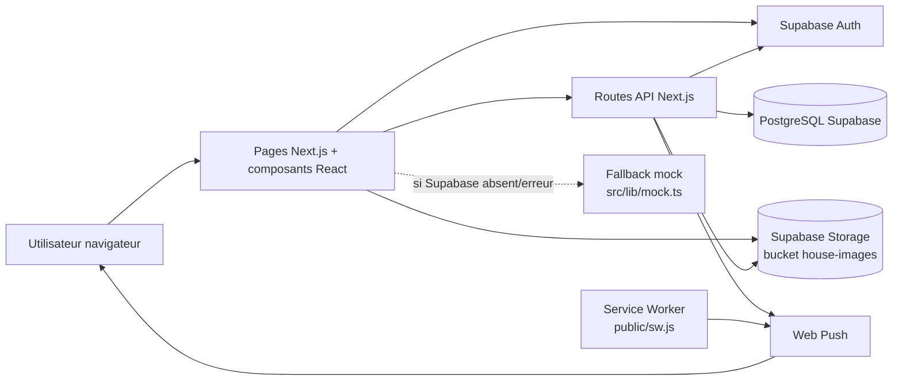

### Points importants pour un diagramme d'architecture

- Le frontend lit surtout via `src/lib/data.ts`.
- Les actions protégées passent par les routes `src/app/api/**/route.ts`.
- `src/lib/supabase.ts` crée le client Supabase public avec timeout.
- Les routes API utilisent le token Bearer via `src/app/api/_supabase.ts`.
- Certaines écritures sensibles utilisent `SUPABASE_SERVICE_ROLE_KEY` si disponible.
- Le stockage des images est séparé dans le bucket public `house-images`.
- Les notifications sont persistées en base, puis envoyées en Web Push si les clés VAPID existent.

## 4. Carte des pages

| Route | Fichier | Fonction |
|---|---|---|
| `/` | `src/app/page.tsx` | Accueil et feed immobilier |
| `/search` | `src/app/search/page.tsx` | Recherche d'annonces |
| `/houses/[id]` | `src/app/houses/[id]/page.tsx` | Détail d'une maison |
| `/add-house` | `src/app/add-house/page.tsx` | Ajout d'une annonce avec image |
| `/contrats` | `src/app/contrats/page.tsx` | Espace contrats |
| `/dashboard` | `src/app/dashboard/page.tsx` | Dashboard selon rôle |
| `/auth` | `src/app/auth/page.tsx` | Connexion / synchronisation utilisateur |

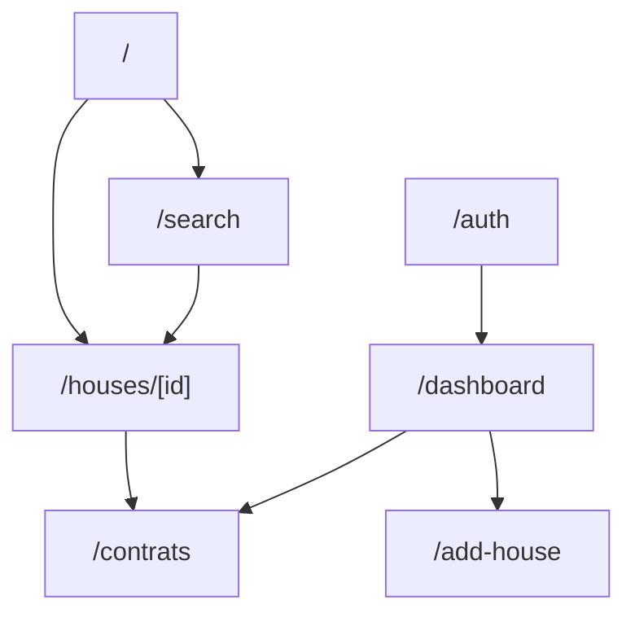

## 5. Routes API principales

| Route API | Méthodes | Responsabilité |
|---|---:|---|
| `/api/houses` | `GET`, `POST` | Liste et création d'annonces |
| `/api/houses/[id]` | `GET`, `PATCH`, `DELETE` | Lecture, modification et suppression d'une maison |
| `/api/contracts` | `GET`, `PATCH` | Liste des contrats d'un utilisateur, création implicite et accord contractuel |
| `/api/users/sync` | `POST` | Synchronise l'utilisateur Supabase Auth vers `public.users` |
| `/api/users/me` | `GET` | Retourne l'utilisateur connecté et ses rôles |
| `/api/roles` | `GET` | Liste les rôles applicatifs |
| `/api/dashboard` | `GET` | Données agrégées du dashboard standard |
| `/api/admin/dashboard` | `GET` | Vue admin complète |
| `/api/admin/users` | `PATCH` | Modification admin d'un utilisateur |
| `/api/notifications` | `GET`, `PATCH` | Liste et lecture des notifications |
| `/api/push/subscribe` | `POST` | Enregistre une souscription Web Push |
| `/api/push/send` | `POST` | Envoi de push côté serveur |

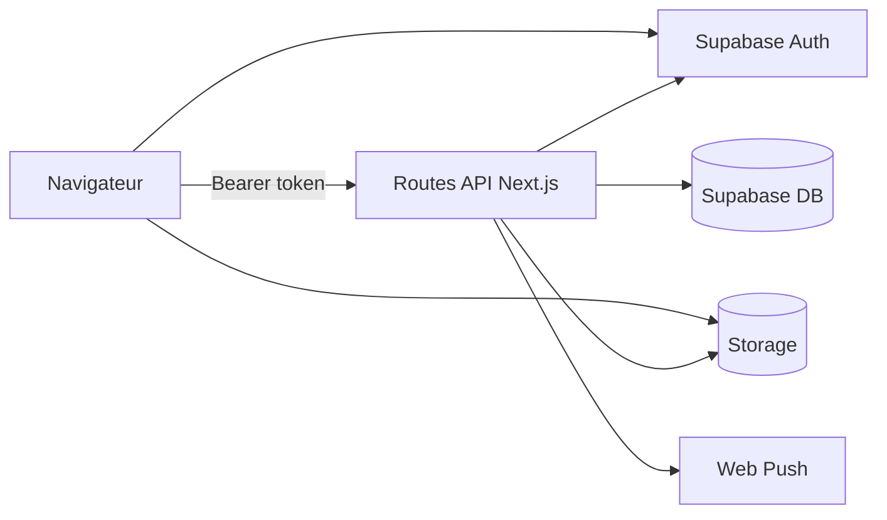

## 6. Modèle de données

### Entités métier

- `role` : référentiel des rôles applicatifs.
- `users` : profil applicatif lié à `auth.users`.
- `houses` : annonces immobilières.
- `rental_requests` : demandes de location ou de contrat.
- `contracts` : contrats numériques avec état et sceau.
- `notifications` : notifications persistantes en base.
- `push_subscriptions` : abonnements navigateur pour Web Push.
- `storage.objects` : fichiers d'images dans le bucket `house-images`.

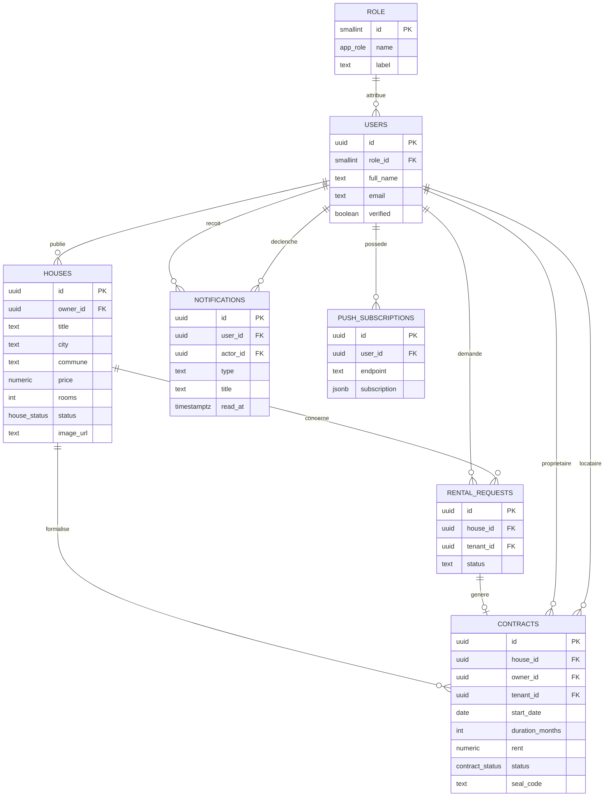

## 7. États métier

### Cycle de vie d'une maison

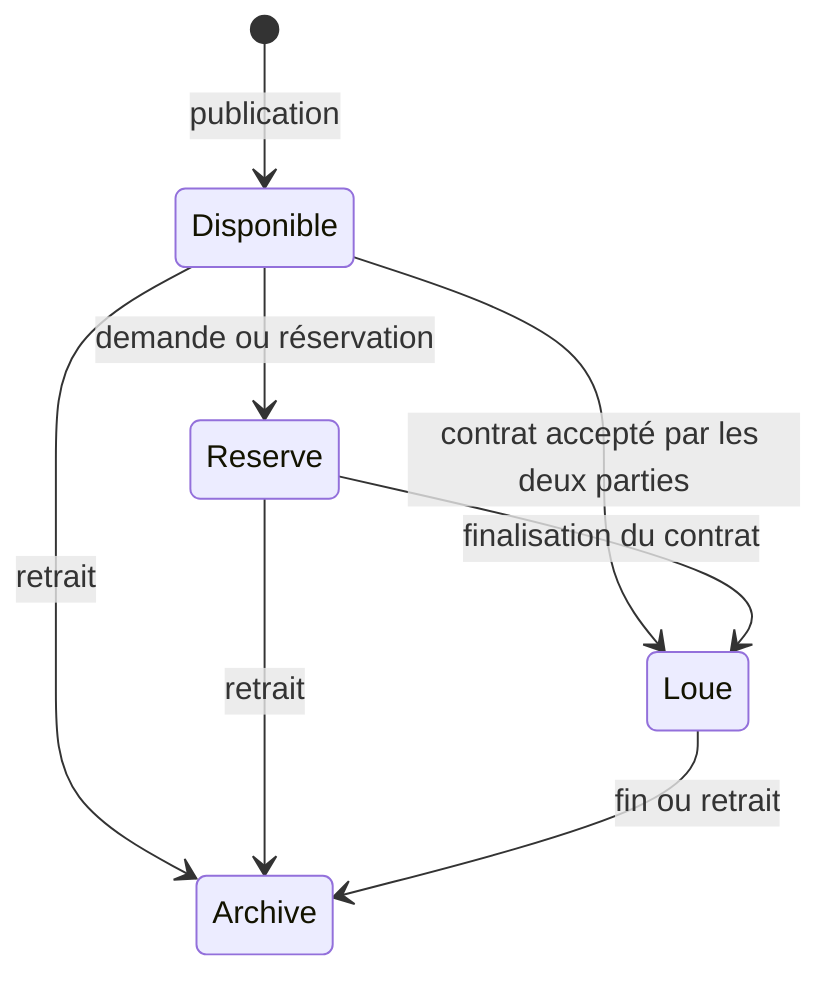

> Dans la base, les statuts exacts sont `Disponible`, `Réservé`, `Loué`, `Archivé`.

### Cycle de vie d'un contrat

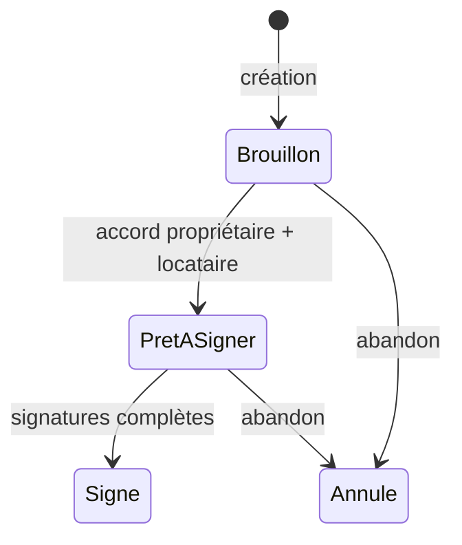

> Dans la base, les statuts exacts sont `brouillon`, `pret_a_signer`, `signe`, `annule`.

## 8. Flux : publication d'une maison

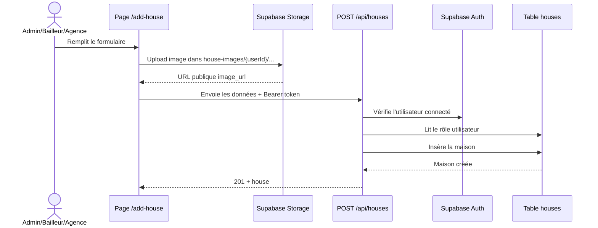

Règles importantes :

- seuls `admin`, `bailleur` et `agence` peuvent publier ;
- l'image est stockée dans `house-images` ;
- les coordonnées latitude/longitude sont validées côté API ;
- l'annonce est liée à `owner_id`.

## 9. Flux : demande et accord de contrat

Le code actuel centralise la logique active dans `/api/contracts` :

- `GET` liste les contrats où l'utilisateur connecté est propriétaire ou locataire ;
- `PATCH` crée ou récupère un contrat pour une maison, puis enregistre l'accord de la partie connectée ;
- quand les deux parties ont donné leur accord, le contrat passe à `pret_a_signer` et la maison peut passer à `Loué`.

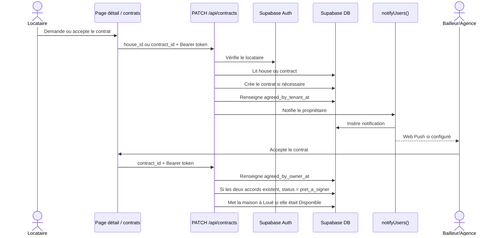

## 10. Flux : notifications

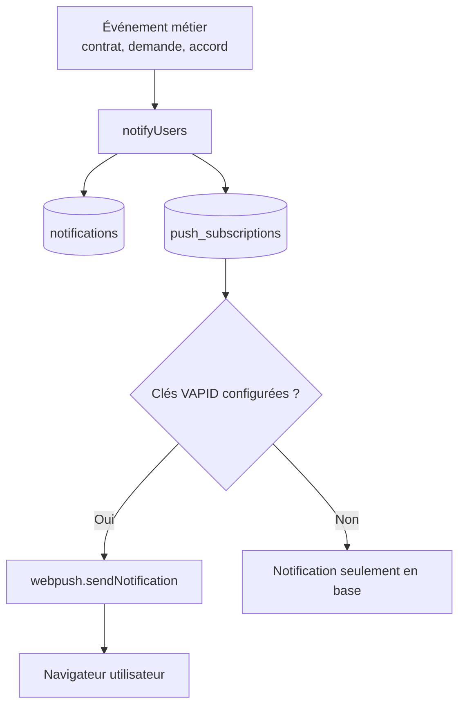

## 11. Sécurité et règles RLS

Le schéma Supabase active Row Level Security sur les tables métier.

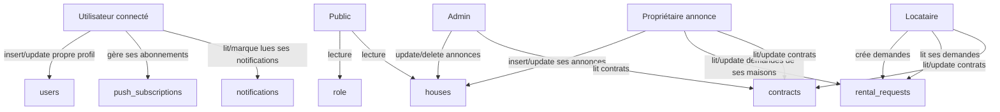

## 12. Modules à représenter dans un diagramme de composants

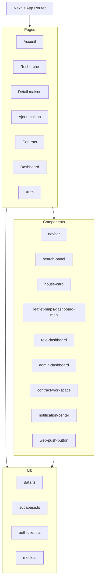

## 13. Glossaire technique

| Élément | Signification |
|---|---|
| `auth.users` | Table interne Supabase Auth, source de l'identité |
| `public.users` | Profil métier de l'utilisateur dans l'application |
| `role_id` | Lien vers le rôle applicatif |
| `owner_id` | Utilisateur qui possède ou publie une annonce |
| `tenant_id` | Locataire impliqué dans une demande ou un contrat |
| `seal_code` | Code de sceau visuel unique du contrat |
| `house-images` | Bucket Supabase public pour les images des annonces |
| `read_at` | Indique qu'une notification a été lue |
| `SUPABASE_SERVICE_ROLE_KEY` | Clé serveur optionnelle pour contourner RLS dans certains traitements serveur |

## 14. Diagrammes recommandés pour documenter le projet

1. **Diagramme de contexte** : acteurs externes, navigateur, app Next.js, Supabase, Web Push.
2. **Diagramme de composants** : pages, composants React, routes API, librairies `src/lib`.
3. **Diagramme ERD** : tables Supabase et relations.
4. **Diagramme de séquence publication** : upload image puis création annonce.
5. **Diagramme de séquence contrat** : locataire, propriétaire, API, notifications.
6. **Diagramme d'états maison** : `Disponible`, `Réservé`, `Loué`, `Archivé`.
7. **Diagramme d'états contrat** : `brouillon`, `pret_a_signer`, `signe`, `annule`.
8. **Diagramme de sécurité RLS** : droits par rôle et par table.

## 15. Sources du code analysées

- `README.md`
- `supabase-schema.sql`
- `docs/database-structure.md`
- `src/types/index.ts`
- `src/lib/data.ts`
- `src/lib/supabase.ts`
- `src/app/api/_supabase.ts`
- `src/app/api/_notifications.ts`
- `src/app/api/houses/route.ts`
- `src/app/api/contracts/route.ts`
